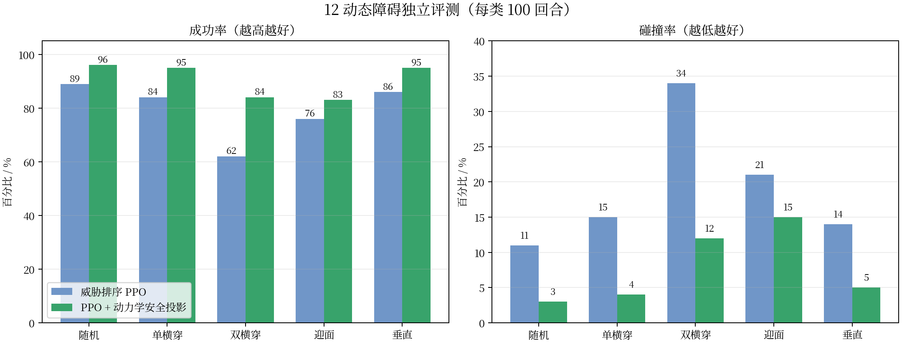

# 四旋翼动态避障优化阶段汇报

生成日期：2026-08-20  
项目目录：`/home/user/UAV_Dreamer`

## 1. 当前结论

系统已形成完整的 12 动态障碍四旋翼任务闭环：CF2X 刚体与电机动力学、起飞悬停、8 帧时序感知、威胁排序 PPO、强制冲突课程、尾部风险评测、动力学约束安全投影，以及停机坪自动降落与停桨。

当前推荐方案为 **stage27 威胁排序 PPO + 动力学安全投影**。它没有覆盖或重写 PPO 动作，而是在预测到 2.5 秒内可能冲突时对世界系速度做有限投影，随后仍经过原有加速度限制、速度—姿态控制、电机响应和 240 Hz 刚体积分。

在五类独立测试中，每类使用相同的 100 个固定种子。与仅使用威胁排序 PPO 相比，推荐方案在所有场景中同时提高成功率、降低碰撞率，且没有增加四旋翼倾角。

## 2. 最终场景参数

| 项目 | 参数 |
|---|---:|
| 场地 | 16 × 16 × 5 m |
| 动态障碍数量 | 12 |
| 障碍半宽 | 0.20～0.35 m |
| 障碍高度 | 1.2～2.8 m；垂直冲突使用悬空小方块 |
| 障碍速度 | 0.08～0.15 m/s |
| 运动幅度 | 0.60 m |
| 起终点距离 | 6～10 m |
| 水平/垂直速度上限 | 1.0 / 0.4 m/s |
| 水平/垂直加速度上限 | 1.5 / 0.6 m/s² |
| 物理/决策频率 | 240 / 10 Hz |
| 起飞 | 0.35 m/s 爬升后定点悬停 2 s |
| 到达判据 | 距停机坪中心 < 0.30 m、速度 < 0.15 m/s，并保持 1 s |

## 3. 算法结构

观测包含四旋翼位姿、机体系速度和角速度、目标相对位置、上一动作、16 束水平 LiDAR，以及三个最高威胁障碍的相对位置和绝对速度。连续保留 8 帧观测：LiDAR 使用环形时空卷积，障碍状态使用 GRU，静态状态使用 MLP，三路融合成 128 维特征后送入 PPO Actor-Critic。

威胁排序不再简单选最近障碍，而是根据三秒预测窗内的最近接近时间、预测 AABB 净空和是否正在闭合排序。这使真正可能相撞的障碍优先进入有限的三个状态槽位。

安全投影参数：预测窗 2.5 s、安全边界 0.70 m、最大速度修正 0.60 m/s。普通随机场景只在约 11.1% 的控制步触发，平均修正约 0.014 m/s，因此主体仍是学习策略。

## 4. 100 回合独立评测

| 场景 | PPO 成功/碰撞 | 推荐方案成功/碰撞 | 成功率变化 | 碰撞率变化 |
|---|---:|---:|---:|---:|
| 普通随机 | 89% / 11% | **96% / 3%** | +7 pp | -8 pp |
| 单横穿 | 84% / 15% | **95% / 4%** | +11 pp | -11 pp |
| 双横穿 | 62% / 34% | **84% / 12%** | +22 pp | -22 pp |
| 单迎面 | 76% / 21% | **83% / 15%** | +7 pp | -6 pp |
| 垂直三维 | 86% / 14% | **95% / 5%** | +9 pp | -9 pp |

双横穿仍是最难场景，但碰撞率已从 34% 降至 12%。其余 4 类场景均达到至少 83% 成功率，普通、单横穿和垂直场景达到 95% 以上。

## 5. 动力学与尾部风险

| 指标 | 普通随机 | 双横穿 |
|---|---:|---:|
| 平均速度 | 0.811 m/s | 0.752 m/s |
| 95% 速度 | 1.422 m/s | 1.352 m/s |
| 95% 倾角 | 7.99° | 8.38° |
| 平均动作变化 | 0.099 | 0.122 |
| P10 最小净空 | 0.226 m | 0.062 m |
| 安全投影激活率 | 11.1% | 27.8% |
| 95% 投影修正 | 0.119 m/s | 0.275 m/s |

安全层没有通过瞬时姿态突变避障：双横穿的 95% 倾角仍约 8.4°，所有速度修正继续受加速度限制。普通场景 P10 最小净空由约 0.063 m 提升到 0.226 m，尾部安全性显著改善。

## 6. 分阶段训练与淘汰记录

1. 直接使用 100% 强制冲突补训导致策略遗忘，成功率降至约 70%，已停止并回退。
2. 改成 25% 强制冲突混合课程后训练稳定，但没有改善固定压力集，未升级权重。
3. “相对速度 + 威胁排序”同时切换导致语义错配；拆分消融后确认主要收益来自威胁排序。
4. 威胁排序在不训练的情况下将单横穿从 77%/23% 改善到 84%/15%，普通场景保持 89%。
5. 迎面专项补训没有提升迎面场景，已淘汰。
6. 盾内补训使普通和双横穿结果退化到 95%/5% 与 81%/17%，已淘汰；最终保留未补训的稀疏安全层。

## 7. 可视化实况

完整任务采用常见工程式分层方案：PPO 负责飞到停机坪上方，随后进入“定点悬停确认 → 0.12 m/s 下降 → 0.30 m 以下以 0.05 m/s 拉平 → 接触/速度/姿态联合判定 → 0.40 s 停桨”的确定性状态机。控制全过程仍经过速度—姿态级联、电机分配和 PyBullet 刚体积分，没有瞬移或直接改写位置。录像种子 10041 共 271 个决策步，最终接触为 True、速度约 0、机体底部高度约 0.063 m、四电机转速为 0。

录像种子 10041，包含起飞与悬停、12 个动态障碍、两个强制横穿障碍、绿色停机坪、8 帧 LiDAR、极坐标扫描、128 维特征、距离/速度/净空/安全修正曲线。该回合 121 步成功到达，最终距离约 0.033 m，无碰撞、无越界。

## 8. 可复现产物

- 推荐 PPO 权重：`outputs/ablations/stage27_shield_g060_m070/ppo_static_obstacle.zip`
- 观测归一化：`outputs/ablations/stage27_shield_g060_m070/vec_normalize.pkl`
- 五类评测：`outputs/evaluation/stage27_shield_*_100/metrics.json`
- 完整任务可视化：`outputs/visualization/stage29_full_mission_autoland.gif`
- 双横穿可视化：`outputs/visualization/stage27_double_crossing_shield_dashboard.gif`
- 数据图脚本：`scripts/plot_stage27_results.py`
- 环境与安全投影：`src/uav_navigation/env.py`
- 训练与尾部评测：`src/uav_navigation/train_ppo.py`
- 时序可视化：`src/uav_navigation/visualize_ppo.py`
- 自动测试：25 项全部通过。

## 9. 下一步

当前系统已满足 12 个慢速动态障碍的稳定研究闭环。后续提高难度时应单独增加传感器噪声、控制延迟、风扰动和质量/惯量随机化，并继续用固定五类场景门控。双横穿的下一目标是将碰撞率从 12% 压到 10% 以下，同时减少 4% 超时；在此之前不建议同时提高障碍速度和数量。
